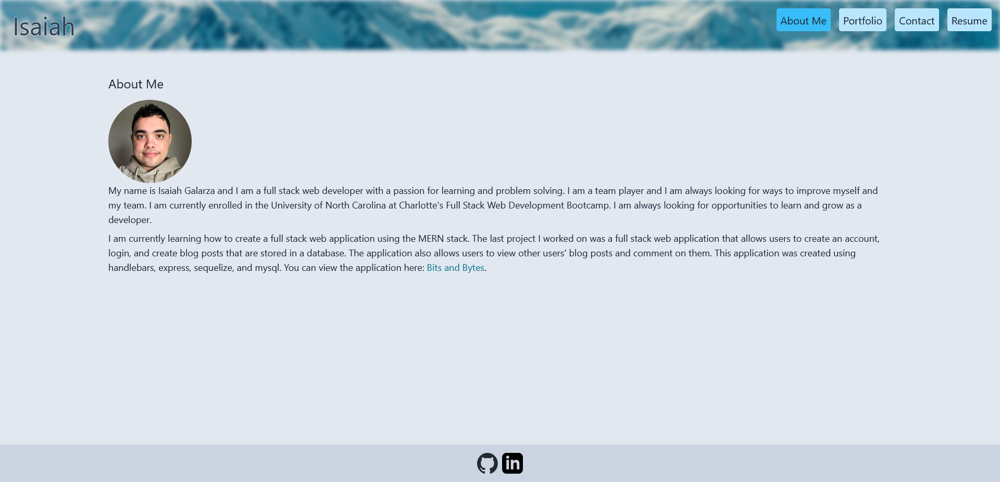

# Portfolio

## Description

A portfolio created using [Create React App](https://create-react-app.dev/). The portfolio uses state to render the different pages of the portfolio which can be switched from the navbar.

## Installation

To run the application, you are required to install the necessary dependencies by running `npm i`.

## Usage

After installing the required dependencies, run the application by running `npm run start`.

## Images

